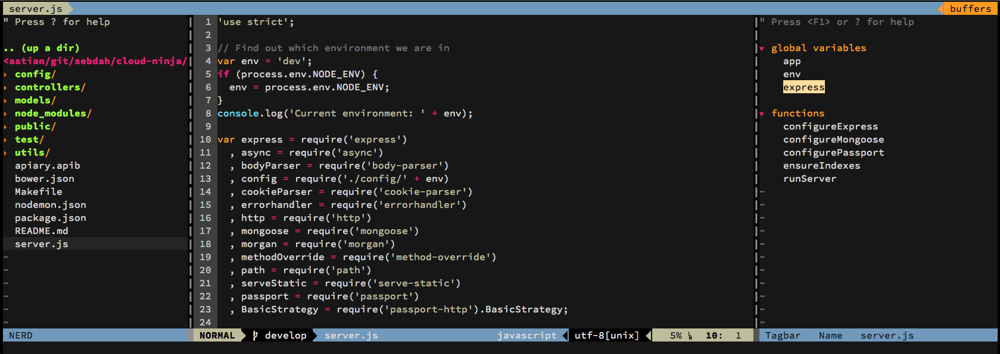

# vim-ide

## Features

- Code completion with [neocomplcache](https://github.com/Shougo/neocomplcache.vim)
- Git integration using [fugitive](https://github.com/tpope/vim-fugitive)
- [NERDTree](https://github.com/scrooloose/nerdtree) file browsing
- Quickly find files, buffers etc. using [CtrlP](https://github.com/kien/ctrlp.vim)
- Clear trailing whitespace
- Syntax validation provided by [syntastic](https://github.com/scrooloose/syntastic)
- vim-airline status bars (with git support)
- Sublime like editing of multiple lines [vim-multiple-cursors](https://github.com/terryma/vim-multiple-cursors)
- Tab completion using [supertab](https://github.com/ervandew/supertab)
- Tab completion in search field ([SearchComplete](https://github.com/vim-scripts/SearchComplete))
- Code tag bar support ([Tagbar](http://majutsushi.github.io/tagbar/))
- Show git changes in the gutter ([gitgutter](https://github.com/airblade/vim-gitgutter))
- Support for Python virtualenvs ([vim-virtualenv](https://github.com/jmcantrell/vim-virtualenv))
- [EditorConfig](http://editorconfig.org/) support
- Auto save buffers when leaving them
- [Emmet.io] support via [emmet-vim](https://github.com/mattn/emmet-vim/)
- Look up documentation in [Dash](https://kapeli.com/dash) directly from vim
- Easy management of surrounding characters (e.g. `echo "Hello world"`) using [surround](https://github.com/tpope/vim-surround)

Supported languages:

- CoffeeScript
- CSS
- Go
- HTML
- Jade
- JavaScript
- Markdown
- Mustache
- Pig
- PowerShell
- Python support (version >=2.6 and >=3.2), including:
   - rope
   - pydoc
   - pylint
   - pep8
   - flakes
   - mccabe
- Ruby
   - Rubocop support
- SCSS (Sassy CSS)
- Stylus
- Thrift
- TypeScript

Included color schemes:

- hybrid (default)
- Tomorrow
- Tomorrow-Night
- Tomorrow-Night-Blue
- Tomorrow-Night-Bright
- Tomorrow-Night-Eighties
- molokai
- solarized (dark and light)
- vividchalk
- And a lot more

To maximize the coolness, make sure that your terminal emulator sports the same color scheme!

## Requirements

- `vim` (8.0 or above) compiled with lua and python3 (E.g. `brew install vim --with-lua --with-python3`)
- `git`
- `ruby`
- `python3`
- `node`
- `gcc`
- `ctags` (if you're on a Mac, install `ctags` via [Homebrew](http://brew.sh/))
- `ag` (OS X: `brew install the_silver_searcher`)
- `jedi` (`pip install jedi`)

The following `npm` modules are not required but recommended for linting support via syntastic.

- `jshint`
- `jsonlint`

## Installation

1. Clone the repo to your computer
2. Run `./install.sh` from the cloned repo root dir
3. (Optional) To get proper symbols for git etc in the status bar
  a. Install a patched font from [powerline/fonts](https://github.com/powerline/fonts)
  b. Set the new font as your terminal font
  c. Enable powerline font support in `~/.vimrc.local` with `let g:airline_powerline_fonts = 1`

## File structure

This is the general file structure for the project

  .vim/
    vimrc
    vimrc.plugins
    config/
      plugins/
        plugin-name.vim
      languages/
        language-name.vim
  .vimrc.local
  .vimrc.plugins.local

Keep all your local configuration in `~/.vimrc.local` and plugins in `~/.vimrc.plugins.local`. Those files are not touched upon re-installation of the project.

## Usage

### Shortcuts

#### File browsing

- `, + d` or `<F2>` - Open the file browser side bar (via [NERDTree](https://github.com/scrooloose/nerdtree))
- `, + f` - Show the current file in the file browser (via [NERDTree](https://github.com/scrooloose/nerdtree))
- `ctrl + p` - Quickly find files, buffers etc using [CtrlP](https://github.com/kien/ctrlp.vim)
- `ctrl + t` - Search for a tag (e.g. classes, functions, methods etc) using [CtrlP](https://github.com/kien/ctrlp.vim). Applies to the currently active buffer
- `ctrl + T` - Search for a tag (e.g. classes, functions, methods etc) using [CtrlP](https://github.com/kien/ctrlp.vim). Applies to all open buffers
- `shift + T` - Open file in new tab from the file browser
- `ma` - Add new file/directory (must be executed in the NERDTree window)
- `mm` - Move/rename new file/directory (must be executed in the NERDTree window)
- `mn` - Delete file/directory (must be executed in the NERDTree window)

#### Function buttons (`F*`)

- `<F1>` - Open vim help screen
- `<F2>` - Toggle file browser sidebar
- `<F3>` - Toggle tagbar
- `<F4>` - Open [Dash](https://kapeli.com/dash) documentation for the keyword
  under the cursor
- `<F9>` - Run lint check for the current language (supported languages: Go,
  Ruby)
- `<F10>` - Run tests for current package / file (supported languages: Go)
- `<F11>` - Go to documentation (only Go is supported at the moment)
- `<F12>` - Go to definition (only Go is supported at the moment)

#### Buffers

- `Shift + Left arrow` - Go to previous buffer
- `Shift + Right arrow` - Go to next buffer
- `, + w` - Close buffer (without closing any windows)

#### Split handling

- `ctrl + l` - Focus the split to the right
- `ctrl + h` - Focus the split to the left
- `ctrl + k` - Focus the split above
- `ctrl + j` - Focus the split below
- `,v` - Split window vertically
- `,h` - Split window horizontally
- `,q` - Close current split

#### Working with text

- `ctrl + n` - Select word under cursor for multiple cursor editing. Press again to go to next occurrence of the word

### Git integration

Git integration is provided via the [fugitive](https://github.com/tpope/vim-fugitive) plug-in. Below are some common examples.

**Status**

    :Gstatus

**Commit (all)**

    :Gcommit
    :Gcommit -a

**Diff**

    :Gdiff

**Push**

    :Gpush origin master

**Adding files**

Open the status window and then press `-` on each file you want to add.

### Commenting code with NERDCommenter

Commenting of code is done via [NERDCommenter](https://github.com/scrooloose/nerdcommenter). You can read detailed documentation on how to comment code with the plug-in [here](https://github.com/scrooloose/nerdcommenter#usage).

- `,cc` - Comment the current line (or visual mode selection)
- `,c ` (`, + c + <space>`) - Toggle commenting on the current line (or visual mode selection)

### CoffeeScript

vim-ide supports CoffeeScript syntax, compiling, linting and indenting (via [vim-coffee-script](https://github.com/kchmck/vim-coffee-script)). Check the project [documentation](https://github.com/kchmck/vim-coffee-script) for details on how to compile and lint your code.

### HTML / CSS editing with Emmet

To expand HTML use `ctrl + y + ,`. Consider that you have typed the following (`_` represents the cursor):

    html:5_

Then type `,e,`

    <!DOCTYPE HTML>
    <html lang="en">
    <head>
        <meta charset="UTF-8">
        <title></title>
    </head>
    <body>
        _
    </body>
    </html>

Another example with tables:

    table>thead+tbody>(tr>td*2)*3

Generates:

    <table>
      <thead></thead>
      <tbody>
        <tr>
          <td></td>
          <td></td>
        </tr>
        <tr>
          <td></td>
          <td></td>
        </tr>
        <tr>
          <td></td>
          <td></td>
        </tr>
      </tbody>
    </table>

Please note that emmet is only enabled for HTML and CSS files.

### Syntax validation

All syntax validation is done via [syntastic](https://github.com/scrooloose/syntastic). It is enabled by default. All you will need to ensure is that you have the checkers for the language that you want to validate installed. E.g. if you want to use JSHint for JavaScript, then you must install JSHint on you system.

To check whether Syntastic has found appropriate validators for the current file type `:SyntasticInfo`. It will output something like:

    Syntastic version: 3.4.0-117
    Info for filetype: javascript
    Mode: active
    Filetype javascript is active
    Available checker: jshint
    Currently enabled checker: jshint

### Folding

All folds are expanded by default. You can use the regular vim folding commands to handle folding. E.g.

- `za` - Toggle folding on one level
- `zA` - Toggle folding, full depth (note that the default `foldnestmax` is set to `10`)

### Surround

You can use any command from the [vim-surround](https://github.com/tpope/vim-surround) package. For example:

#### Change surrounding characters

You can change surrounding characters with the `cs` command.

**Example**

Replace the `"` with `'` in this string by typing `cs"'`:

    echo "Hello world"

Becomes

    echo 'Hello world'

#### Delete surrounding characters

You can delete surrounding characters with the `ds` command.

**Example**

Delete `"` by typing `ds"`:

    echo "Hello world"

Becomes

    echo Hello world

#### Surround a specific word

You can add surroundings to a specific word with the `ysiw` command.

**Example**

Add `[` around `Hello` by moving the cursor to `Hello` and the type `ysiw[`:

    echo Hello world

Becomes

    echo [ Hello ] world

#### Surround a whole line

You can change the surrounding on a whole line with the `yss` command.

**Example**

Add `{` around a line by typing `yss{`

    echo "Hello world"

Becomes

    { echo "Hello world" }

## Contribution

Please feel free to contribute by sending pull requests or file issues in the bug tracker. All project development is done on the projects [GitHub page](https://github.com/sebdah/vim-ide).

## License

    The MIT License (MIT)

    Copyright (c) 2014-2015 Sebastian Dahlgren

    Permission is hereby granted, free of charge, to any person obtaining a copy
    of this software and associated documentation files (the "Software"), to deal
    in the Software without restriction, including without limitation the rights
    to use, copy, modify, merge, publish, distribute, sublicense, and/or sell
    copies of the Software, and to permit persons to whom the Software is
    furnished to do so, subject to the following conditions:

    The above copyright notice and this permission notice shall be included in
    all copies or substantial portions of the Software.

    THE SOFTWARE IS PROVIDED "AS IS", WITHOUT WARRANTY OF ANY KIND, EXPRESS OR
    IMPLIED, INCLUDING BUT NOT LIMITED TO THE WARRANTIES OF MERCHANTABILITY,
    FITNESS FOR A PARTICULAR PURPOSE AND NONINFRINGEMENT. IN NO EVENT SHALL THE
    AUTHORS OR COPYRIGHT HOLDERS BE LIABLE FOR ANY CLAIM, DAMAGES OR OTHER
    LIABILITY, WHETHER IN AN ACTION OF CONTRACT, TORT OR OTHERWISE, ARISING FROM,
    OUT OF OR IN CONNECTION WITH THE SOFTWARE OR THE USE OR OTHER DEALINGS IN
    THE SOFTWARE.

